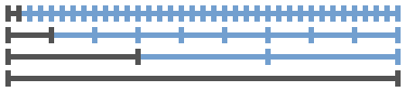

# [Reddit Time Machine](http://www.reddittimemachine.com)
## Check out what was up on reddit days/weeks/months ago.

Did you also always wonder what reddit was talking about on your birthday 4 years ago? Or did you just remember that you forgot to check reddit on 2007-09-23? Then [Reddit Time Machine](http://www.reddittimemachine.com) is just for you! ;-)

With the [built-in search function on reddit](http://www.reddit.com/wiki/search) you can ([without much manual effort](http://www.reddit.com/r/help/comments/27eziq/view_top_posts_of_a_specific_timespan/)) only choose time intervals ending in the now (dark gray in the image below). [Reddit Time Machine](http://www.reddittimemachine.com) lets you generate links for different intervals (blue in the image below) comfortably with just a few clicks.

todo:
- ads
- code clean up und comments
- post on /r/webdev and /r/elm
- wait for issues to be fixed or find cleaner workarounds